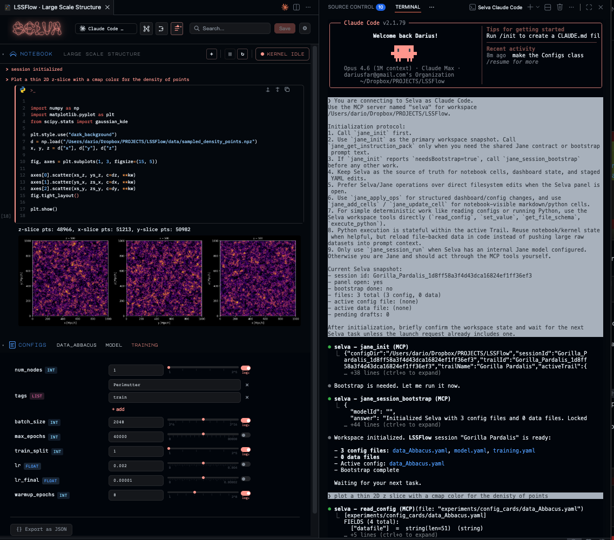

# Selva

Selva is a MCP-backed workspace for scientific projects through a notebook-style agent interface. It combines a visual YAML dashboard, a persisted notebook with stateful Python kernel, Task-based session management, and an MCP server for external coding agents.

### Snapshot



### Jane (Jupyter-like Agentic Notebook Engine)

Jane is Selva's persisted runtime. It tracks notebook entries, conversation history, dashboard state, and model configuration. Jane can be driven from inside the Selva panel or through MCP tools by external agents (Claude Code, Codex).

### Tasks

A Task is a persisted notebook lineage for a workspace, stored as a `.svnb` file under `.selva/tasks/`. Each Task isolates notebook cells, session state, dashboard configuration, and Python kernel state. Tasks are named with jungle-style bigrams (e.g. `Okapia Callidryas`).

### Stateful Python Kernel

Python execution is stateful within the active Task — variables persist across cells, like Jupyter. Tasks isolate Python state from one another. The notebook UI exposes kernel status, interrupt, and restart controls.

Large datasets should be loaded from disk in code, not pushed into model context.

### Tooling

Selva exposes workspace tools (deterministic operations on YAML files and Python execution) and Jane session tools (notebook/Task management) via MCP. Tools include `execute_python`, `get_file_schema`, `setValue`, `lockField`, `pinField`, `propose_tool`, and the full `jane_*` session API.

The `propose_tool` system lets agents create new reusable tools at runtime, persisted to `~/.selva/ecosystem/tools/`.

### Architecture

- `extension.js` — VS Code activation, panel lifecycle, message bridge
- `mcp-server.js` — stdio MCP server for external agents
- `lib/jane-runtime.js` — Jane session runtime, Task-aware tools
- `lib/session-store.js` — Task persistence and file locking
- `lib/kernel-manager.js` — stateful Python kernel manager
- `lib/selva-runtime.js` — workspace runtime and tool loading
- `handlers/` — message handler modules (task, agent, file, kernel, settings)
- `ecosystem/tools/` — built-in tool implementations
- `media/` — notebook/dashboard UI

### Requirements

- VS Code `^1.95.0`
- Python 3 available as `python3`
- Optional: `ANTHROPIC_API_KEY` and/or `OPENAI_API_KEY` for direct API access

### Development

```bash
npm install
npm test
npm run mcp -- /path/to/workspace
```

Open in VS Code, launch via `Selva` command or `Cmd+Shift+J`.

## License

MIT
